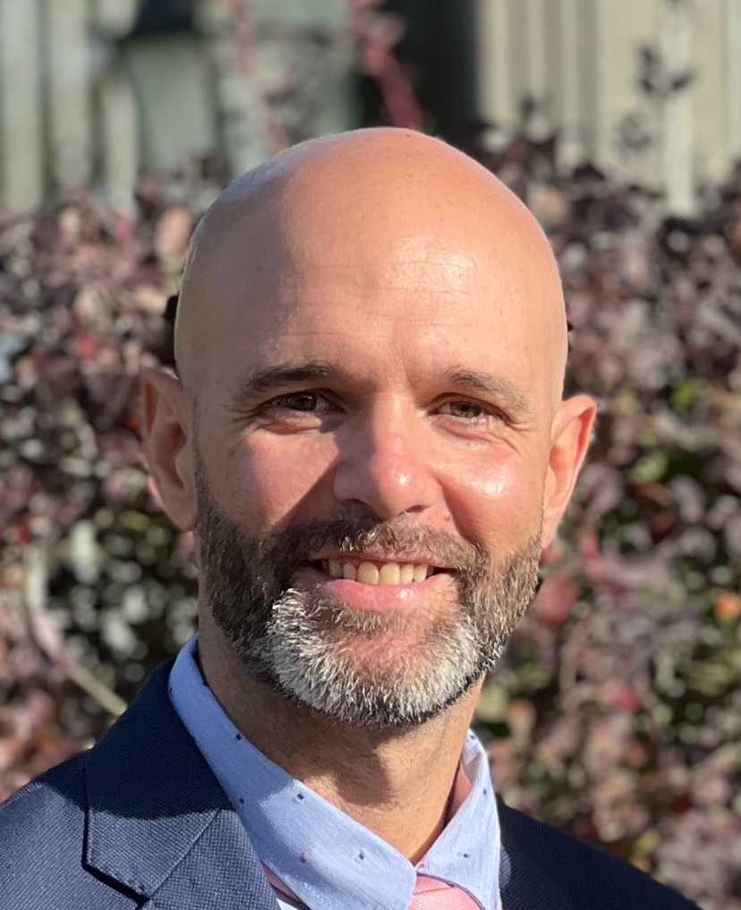

<h1 style="margin-bottom: 0;">Edu Poveda</h1>

  <b>Junior Full-Stack Developer</b> · Backend-focused

  
  
  

  

---

## 🚀 About me (EN)

I’m a **junior full-stack developer**, strongly oriented towards **backend development**.

I focus on:
- building solid foundations  
- writing clean and readable code  
- understanding business logic and system behavior  
- learning by building real projects (no fluff)

🎯 **Goal:** land my first role as a developer and grow in a professional environment.

---

## 🧰 Tech stack (in progress)

 

---

## 📌 What you’ll find here

| ✅ Content | 🔍 Focus |
|---|---|
| Django learning projects | Backend fundamentals |
| Small full-stack builds | Clean structure |
| Iterative improvements | Real progress |

---

## 🎯 Current focus

- 🏗️ First complete **Django project** (auth, CRUD, clean architecture)
- 🔐 Authentication & permissions fundamentals
- 🚀 Consistent commits and documentation

---

## 📊 GitHub stats

---

<b>🇪🇸 Versión en español (clic para desplegar)</b>

 

## Sobre mí

Soy **desarrollador Full-Stack junior**, con mayor orientación a **backend**.  
Estoy construyendo una base sólida mediante proyectos reales, cuidando la estructura del código, los commits y la documentación.

Me interesa especialmente:
- Python y Django  
- la lógica de negocio  
- entender cómo funcionan los sistemas por dentro  

🎯 **Objetivo:** conseguir mi primera oportunidad como desarrollador y seguir creciendo profesionalmente.

---

<b>Building real things, one commit at a time.</b> 🚀

